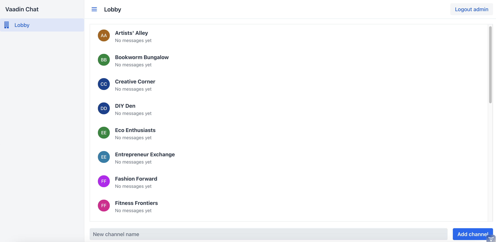

# Spring Boot Chat Application

## Overview

This is a chat application built with Spring Boot and Vaadin Flow UI. The application allows users to create chat channels, send messages, and view message history in real-time. 



## Features

- **User Authentication**: Secure login for users and an admin role.
- **Channel Management**: Users can create and manage chat channels.
- **Real-time Messaging**: Messages are sent and received in real-time.
- **Message History**: Retrieve previous messages from each channel.
- **Responsive UI**: Built using Vaadin Flow for a modern web interface.

## Technologies Used

- **Backend**: Spring Boot
- **Frontend**: Vaadin Flow UI
- **Database**: In-memory storage for messages and channels
- **Security**: Spring Security for authentication and role management

## Getting Started

### Prerequisites

- Java 17 or later
- Maven

### Installation

1. Clone the repository:

   ```
   git clone https://github.com/yourusername/chat-application.git
   cd chat-application
   ```
2. Build the project:
   
    ```
    mvn clean install
    ```
3. Run the application:
      
    ```
    mvn spring-boot:run
    ```
    Open your browser and navigate to http://localhost:8080.

### Usage
- You can log in as one of the following users:

  - Username: alice, Password: password
  - Username: bob, Password: password
  - Username: admin, Password: password

- Create new chat channels and interact with users in real-time.
